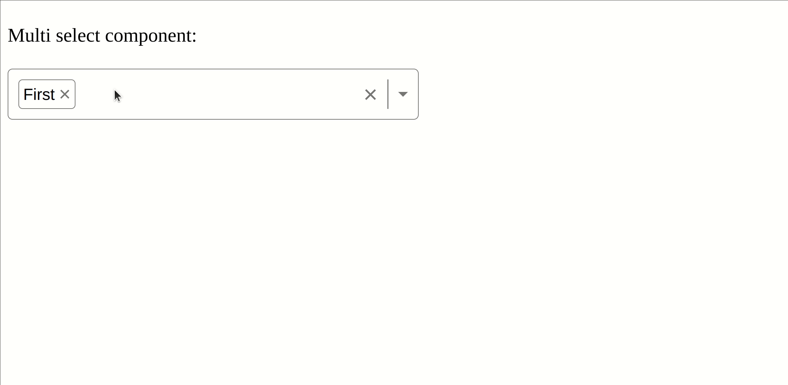

# SELECT COMPONENT

This project was created using Vite + React + TS.


> Note: This project was bootstrapped with [Create Vite App](https://vitejs.dev/guide/)

## Single select component


## Multi select component



## Setup
1. Clone this repo
2. Install all the dependencies (npm install)
3. Run in a terminal: `npm run dev`

## Deploy a new version
 Navigate to the scripts folder:

 ```bash
 cd scripts/
 ```

 And execute the `deploy.sh` script:

 ```bash
 ./deploy.sh
 ```


## Use the keyboard to interact with the component

⌨️ Command | 🖥️ Action
------- | ------
tab| activate the select componet
space | open list of possible selections
⬆️| navigate up
⬇️ | navigate down


> Disclaimer: This project is based on this tutorial: https://www.youtube.com/watch?v=bAJlYgeovlg&t=1s&ab_channel=WebDevSimplified
